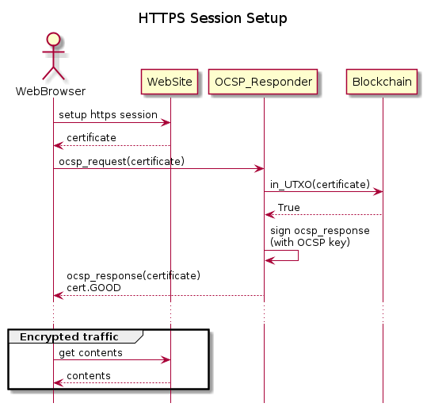

# UTXO-PKI
This project demonstrates the academic paper "A Scalable Bitcoin-Based Public Key Certificate Management System".

The key concept is that certificates are recorded as unspent bitcoin transactions.
That is, they are recorded as transactions in the unspent transaction output (UTXO) of the bitcoin network. 

Once the transactions associated with certificates are spent they are considered invalid.

Documentation for this project can be found in "UTXO for PKI" in nChain's sharepoint.

Please note that this is a fork of the original project. This code base has been modified to interface with the UTXO-as-a-Service program. This version of the UTXO-PKI needs some work to make the interface between itself & the UAAS is generic and stable. Specifically, the rest endpoints for the uaas could be extracted away into another BSV client. However, if we do that, we'll need to allow the uaas to submit transactions to the network. That requires quite aa bit of work on that which is currently beyond the scope of the identity demo. 

# UTXO-PKI Contents
UTXO-PKI contains a `Monitor` service which runs in a docker container. This provides:
* Certificate Authority (CA) for generating certificates.
* A Certificate Monitor that is responsible for recording the certificate status to the blockchain.
* Online Certificate Status Protocol (OCSP) Responder at /ocsp.
* REST interface to the service.

## Options to start the `Monitor` service. 
There are two scripts to help start the monitor service depending on the requirements of the user. 

If the user is running a local regtest version of bitcoind the please run:
* run.sh 

If the user is running with testnet or mainnet then please run:
* run-not-localSV.sh

Both scripts execute bitcoind in a docker container however the former expects a local version of SV while the later will connect to either the public testnet or mainnet. 

## REST API/web interface
The REST API/web interface is avalible at https://localhost:5003/docs. This interface enables the creation, revoking and checking of certificates.

# UTXO-PKI Usecase/Demonstration
UTXO-PKI can be used is to provide certificate status information for a server certificate that is used for authenticating and securing traffic between a browser and website. 

This is shown in the following diagram: 

In the `HTTPS Session Setup` diagram it can be seen that the `OCSP_Reponder` queries the Blockchain to determine the website certificate status.

The Certificate Authority (CA) is used to generate and sign certificates.

The following diagram shows how the CA created certificates are used in the HTTPS session usecase above:

# Further documentation

* To setup this project see [here](docs/System_setup.md)
* OCSP details [here](docs/OCSP.md)
* CA details are [here](docs/CA.md)
* `openssl` commands that maybe useful [here](docs/Openssl.md)
* Developer tools can be found [here](docs/Developer_tools.md)

