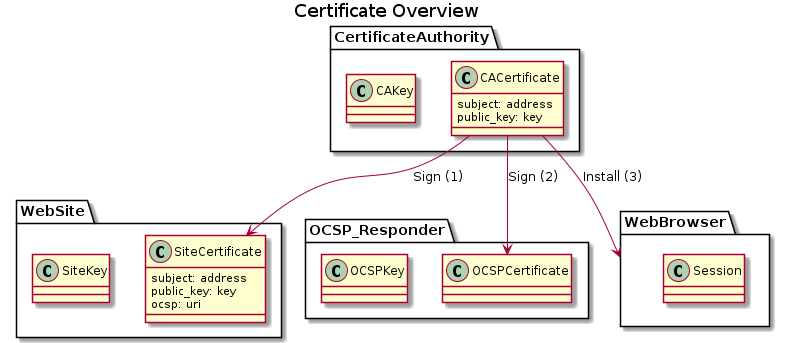

# Certificate Authority 
This is a Certificate Authority (CA) in a Docker image.
The Certiicate Authority is based on Easy-RSA and can be used to create X.509 certificates.

This was created using the following tutorial https://www.digitalocean.com/community/tutorials/how-to-set-up-and-configure-a-certificate-authority-ca-on-ubuntu-20-04

The Certificate Authority is used to create the following certificates:



## Instructions

## Build docker image

```bash
./build.sh

```
## Start docker image
```bash
./run.sh
```

## Setup EasyRSA PKI
```
./setup.sh
```


## EasyRSA Files
When building a CA, a number of new files are created by a combination of Easy-RSA and (indirectly) openssl. 

The important CA files are:

* `ca.crt` - This is the CA certificate
* `index.txt` - This is the "master database" of all issued certs
* `serial` - Stores the next serial number (serial numbers increment)
* `private/ca.key` - This is the CA private key (security-critical)
* `certs_by_serial/` - dir with all CA-signed certs by serial number
* `issued/` - dir with issued certs by commonName

### Index.txt File 

The index.txt file is an ASCII file consisting of 6 tab-separated fields, these are:

1) Entry type. May be "V" (valid), "R" (revoked) or "E" (expired).
Note that an expired may have the type "V" because the type has
not been updated. 'openssl ca updatedb' does such an update.
2) Expiration datetime.
3) Revocation datetime. This is set for any entry of the type "R".
4) Serial number.
5) File name of the certificate. This doesn't seem to be used,
ever, so it's always "unknown".
6) Certificate subject name.

Note that the datetime format is yymmddHHMMSSZ (Z = Zulu = UTC).

## Create certificate
The CA can sign certificates.
The process is shown in the following diagram:


The cerificate creation steps are as follows:
1) Create a key
```bash
openssl genrsa -out my-server.key
```
2) Create a Certificate Signing Request (CSR)
```bash
openssl req -new -key my-server.key -out my-server.req -subj "/C=UK/ST=Greater London/L=London/O=nChain/OU=Research/CN=my-server"
```
3) Post the CSR to Certificate Authority for signing
Note that this can also be done through the web interface at `https://localhost:5003/docs`
```bash
curl -X 'POST' \
  'https://localhost:5003/sign_csr' \
  -H 'accept: application/json' \
  -H 'Content-Type: multipart/form-data' \
  -F 'file=@my-server.req'
```
4) Install certificate


## Openssl
There are additional openssl commands that maybe useful [here](Openssl.md)